# On the Integration of Privacy and OpenFL
Federated learning (FL) enables parties to learn from each other without sharing their data. In FL, parties share the local update about a global model in each round with a server. The server aggregates the local updates from all parties to produce the next version of the global model, which will be used by all parties as the initialization for training in the next round. 

Although each party's data remains local, the shared local updates and aggregate global model each round can leak significant information about the private local training datasets. Specifically, the server can infer information about (even potentially reconstruct) the private data from each party based on their shared local update. Even when the server is trusted, collaborating parties of FL can infer other parties' sensitive data based on the updated global model in each round due to the fact that it is influenced by all local model updates. Due to this serious privacy issue, enabling parties to audit their privacy loss becomes a compelling need. 

Privacy meter, based on state-of-the-art membership inference attacks, provides a tool to quantitatively audit data privacy in statistical and machine learning algorithms. The objective of a membership inference attack is to determine whether a given data record was in the training dataset of the target model. Measures of success (accuracy, area under the ROC curve, true positive rate at a given false positive rate ...) for particular membership inference attacks against a target model are used to estimate privacy loss for that model (how much information a target model leaks about its training data). Since stonger attacks may be possible, these measures serve as lower bounds of the actual privacy loss. We have integrated the ML Privacy Meter library into OpenFL, generating privacy loss reports for all party's local model updates as well as the global models throughout all rounds of the FL training. 

## Threat Model
Following this, we consider two threat models.
- Server is trusted, and other parties are honest-but-curious (follow the protocol, but try to learn as much as possible from what information they have access to)
In this threat model, each party can audit the privacy loss of the global model, quantifying how much information will be leaked to other parties via the global model.
- Everyone, including the server, is honest-but-curious
In this threat model, each party can audit the privacy loss of the local and global models, quantifying how much information will be leaked to the aggregator via the local model and to the other parties via the global model.

## Workflow
We provide a demo code in `cifar10_PM.py`. Here, we briefly describe its workflow.
In each round of FL, parties train, starting with the current global model as initialization, using their local dataset. Then, the current global model and updated local model will be passed to the privacy auditing module (See `audit` function in `cifar10_PM.py`) to produce a privacy loss report. The local model update will then be shared to the server and all such updates aggregated to form the next global model. Though this is a simulation so that no network sharing of models is involved, these reports could be used in a fully distributed setting to trigger actions when the loss is too high. These actions could include not sharing local updates to the aggregator, not 
allowing the FL system to release the model to other outside entities, or potentially re-running local training in a differentially private mode and re-auditing in an attempt to reduce the leakage before sharing occurs.

## Methodology
We integrate the population attack from ML Privacy Meter into OpenFL. In the population attack, the adversary first computes the signal (e.g., loss, logits) on all samples in a population dataset using the target model. The population dataset is sampled from the same distribution as the train and test datasets, but is non-overlapping with both. The population dataset signals are then used to determine (using the fact that all population data are known not to be target training samples) a signal threshold for which false positives (samples whose signal against the threshold would be erroneously identified as target training samples) would occur at a rate below a provided false positive rate tolerance. Known positives (target training samples) as well as known negatives (target test samples) are tested against the threshold to determine how well this threshold does at classifying training set memberhsip. 

Therefore, to use this attack for auditing privacy, we assume there is a set of data points used for auditing which is not overlapped with the training dataset. The size of the auditing dataset is indicated by `audit_dataset_ratio` argument. In addition, we also need to define which signal will be used to distinguish members and non-members. Currently, we support loss, logits and gradient norm. When the gradient norm is used for inferring the membership information, we need to specify which layer of the model we would like to compute the gradient with respect to. For instance, if we want to measure the gradient norm with respect to the 10th layer of the representation (before the fully connected layers), we can pass the following argument `--is_feature True` and `--layer_number 10` to the `cifar10_PM.py`.

To measure the success of the attack (privacy loss), we generate the ROC of the attack and the dynamic of the AUC during the training. In addition, parties can also indicate the false positive rate tolerance, and the privacy loss report will show the maximal true positive rate (fraction of members which is correctly identified) during the training. This false positive rate tolerance is passed to `fpr_tolerance` argument. The privacy loss report will be saved in the folder indicated by `log_dir` argument.


## Examples
Here, we give a few commands and the results for each of them. 


### Auditing the privacy loss based on the model loss, logits, and gradient norm (the 10th layer of the representation), where the model is trained using SGD.

**Command:**
> `python cifar10_PM.py --audit_dataset_ratio 0.2 --test_dataset_ratio 0.4 --train_dataset_ratio 0.4 --signals loss logits gradient_norm --fpr_tolerance 0.1 0.2 0.3 --log_dir test_sgd --comm_round 30 --optimizer_type SGD --is_feature True --layer_number 10`

**Results:**
The performance of the target model is as follows:
```
Average aggregated model validation values = 0.6624583303928375
Average training loss = 0.5036337971687317
Average local model validation values = 0.622083306312561
```

**Reports:**
The figures generated for the privacy loss are shown as below:

Seattle:
||||||
|---|---|---|---|---|
|||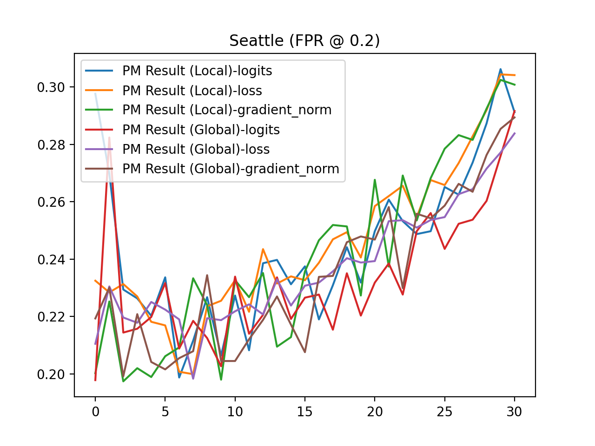|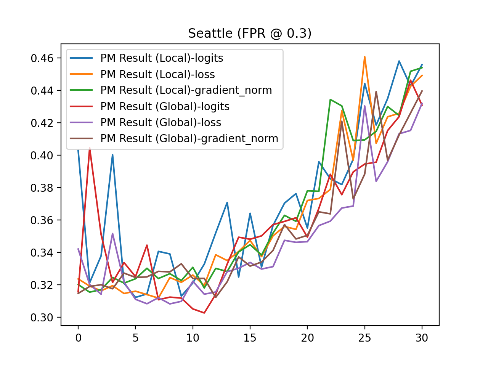|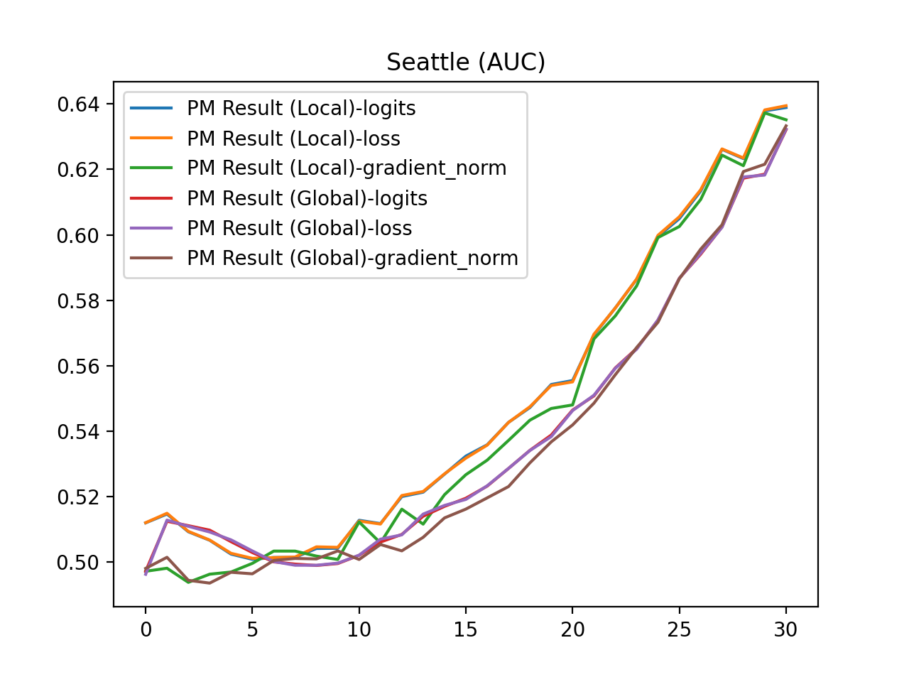|


Portland:
||||||
|---|---|---|---|---|
|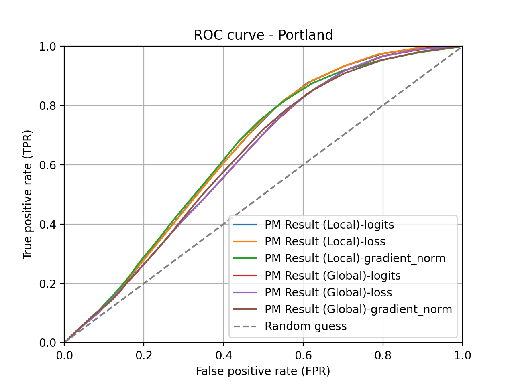|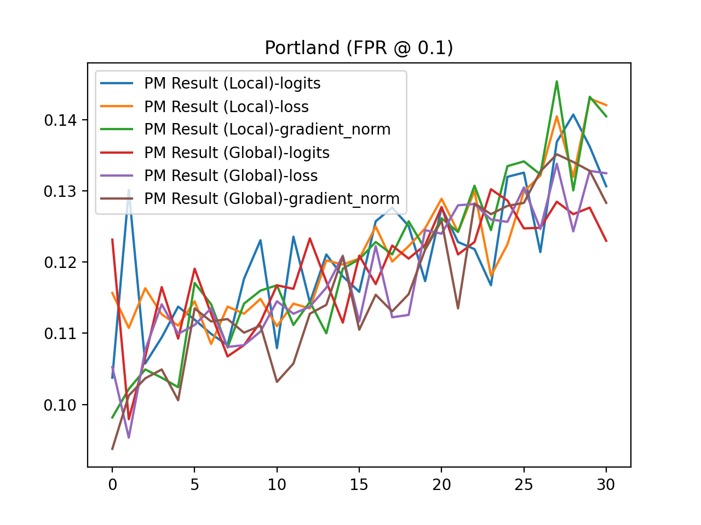|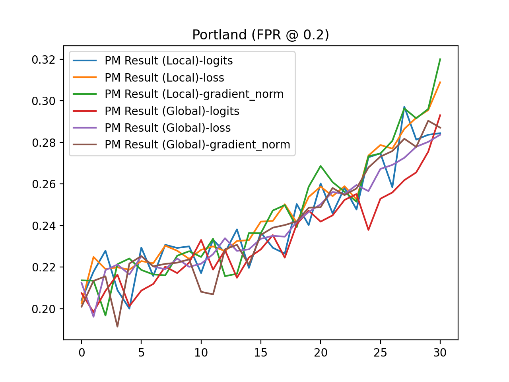|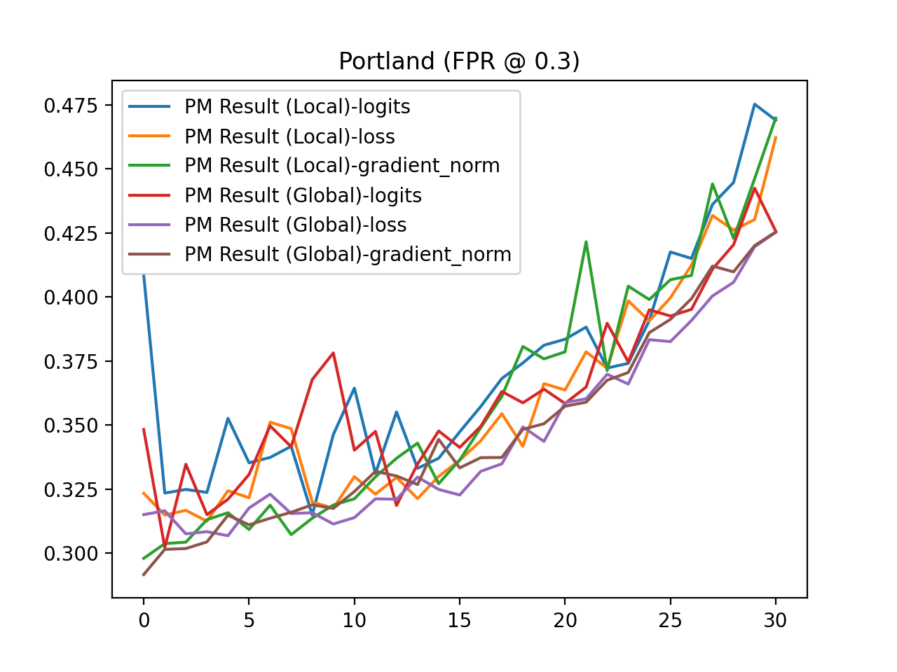|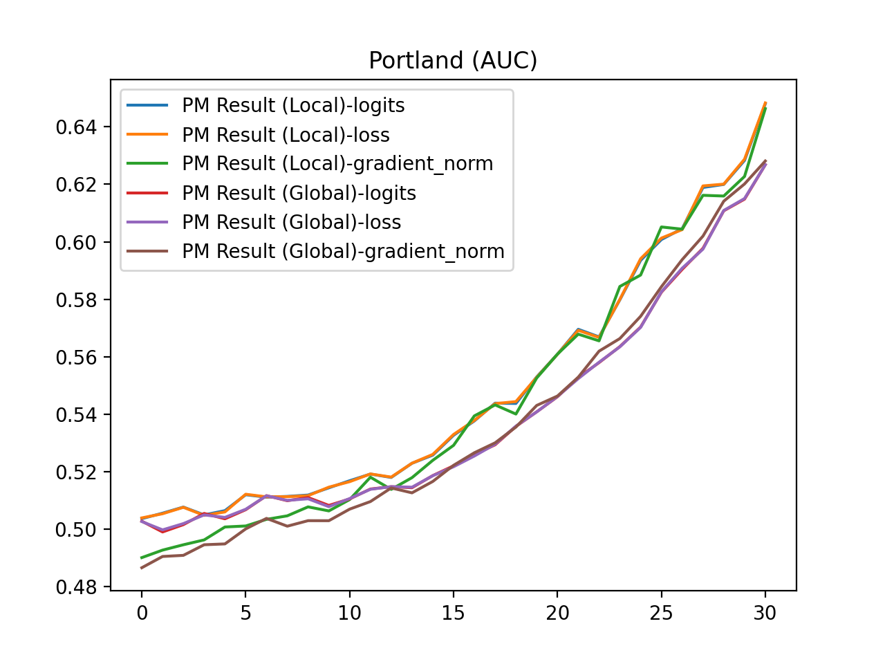|


### Auditing the privacy loss based on the model loss, logits, and gradient norm (the 10th layer of the representation), where the model is trained using Adam.
**Command:**
> `python cifar10_PM.py --audit_dataset_ratio 0.2 --test_dataset_ratio 0.4 --train_dataset_ratio 0.4 --signals loss logits gradient_norm --fpr_tolerance 0.1 0.2 0.3 --log_dir test_adam --comm_round 30 --optimizer_type Adam --is_feature True --layer_number 10`

The performance of the target model is as follows:
```
Average aggregated model validation values = 0.6075416505336761
Average training loss = 0.4626086503267288
Average local model validation values = 0.594041645526886
```

**Reports:**
The figures generated for the privacy loss are shown as below:

Seattle:
||||||
|---|---|---|---|---|
|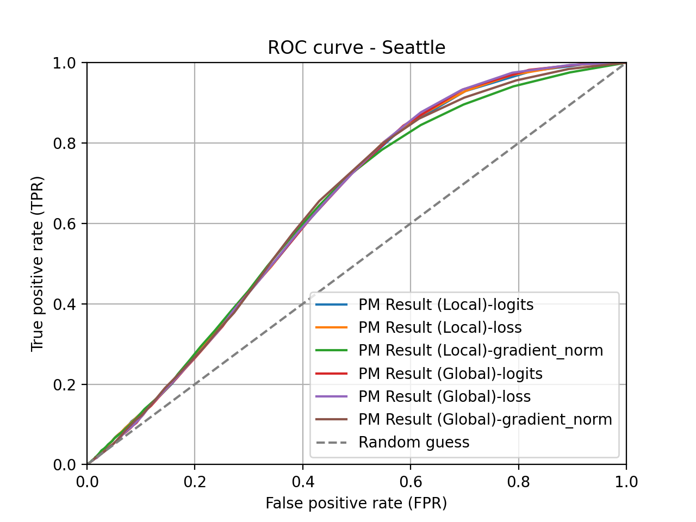|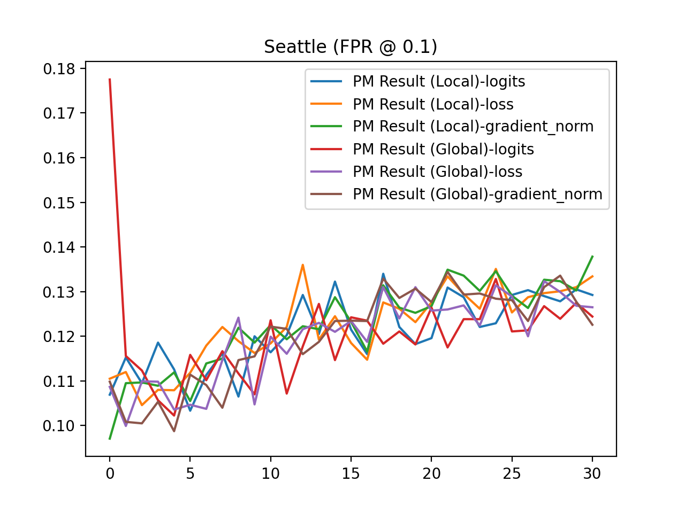|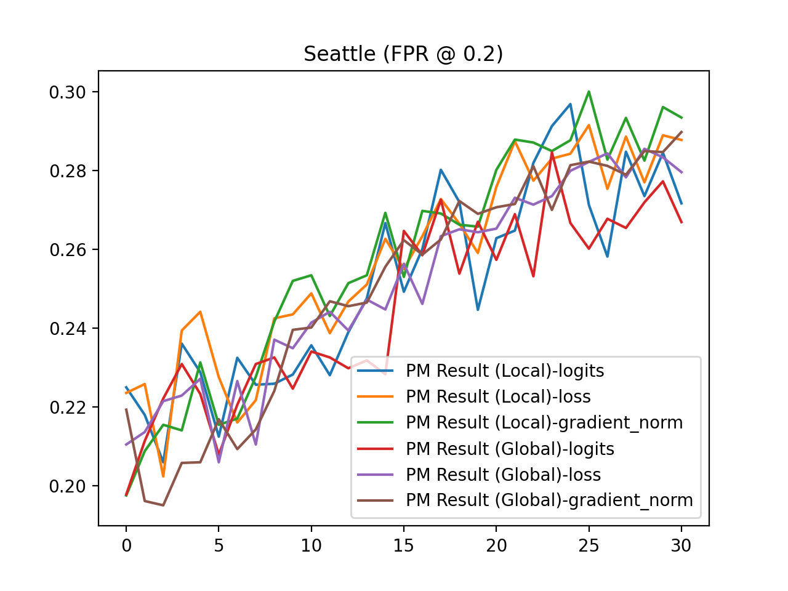||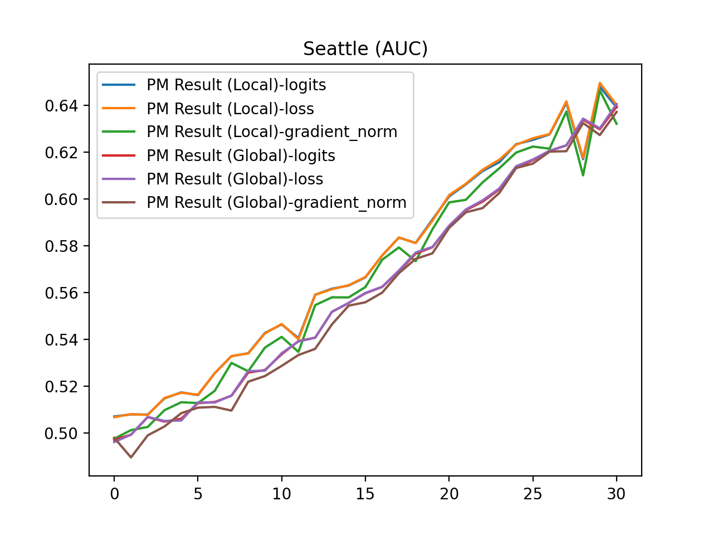|


Portland:
||||||
|---|---|---|---|---|
|||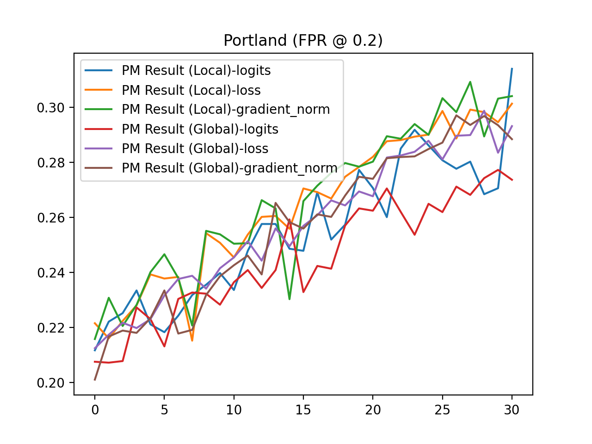|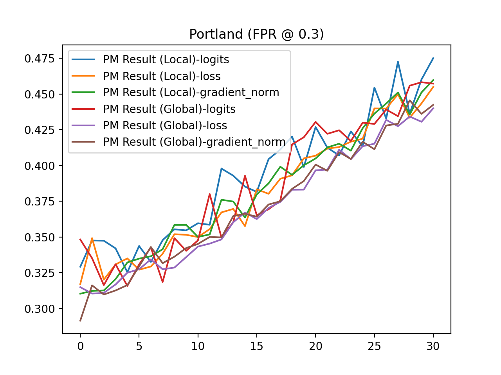||
